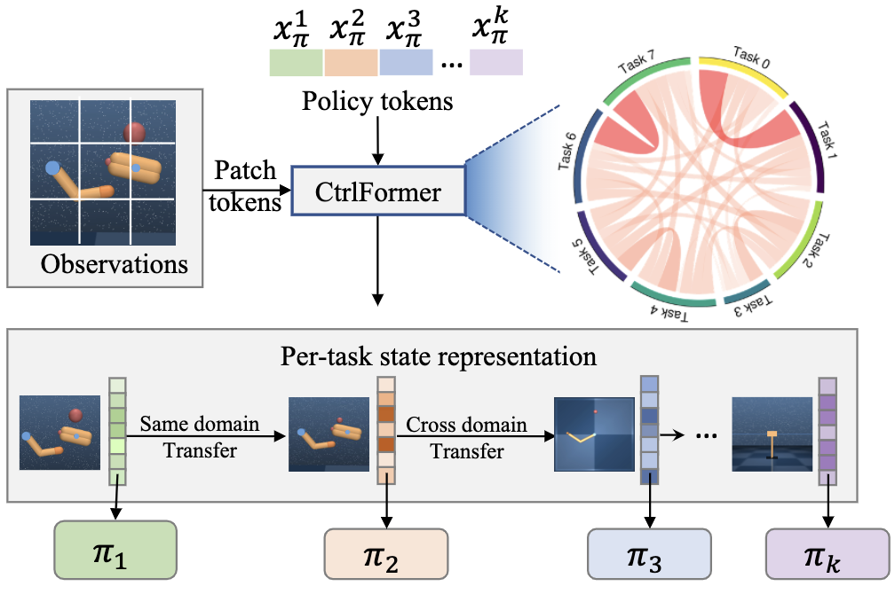

# CtrlFomer: Learning Transferable State Representation for Visual Control via Transformer

This is a PyTorch implementation of **CtrlFomer**.

The whole framework is shown as follow:


## Requirements

We assume you have access to a gpu that can run CUDA 11.2 and Driver 460.91.03.

python 3.6.13
torch  1.9.1
gcc    9.2

Then, the simplest way to install all required dependencies is to create an anaconda environment by running


```

conda env create -f conda_env.yml

```

After the instalation ends you can activate your environment with
```

conda activate CtrlFormer

```


To train the CtrlFormer run
```

python3 train.py  batch_size=512 action_repeat=2 env_index=[0,1,2,3,4]

```


This will produce the `runs` folder, where all the outputs are going to be stored including train/eval logs, tensorboard blobs, and evaluation episode videos. To launch tensorboard run
```

tensorboard --logdir runs

```

#### IMPORTANT: All the dropout operators in vision transformer are removed in this repo since it is not suit for online RL tasks. 

#### IMPORTANT: please use a batch size of 512 to reproduce the results in the paper.

#### IMPORTANT: And if action_repeat is used the effective number of env steps needs to be multiplied by action_repeat in the result graphs. This is a common practice for a fair comparison. The hyper-parameters of action_repeat for different task is set as follow:
|  Env   | action_repeat  |
|  ----  | ----  |
| cartpole_swingup  | 8 |
| reacher_easy  | 4 |
| cheetah_run  | 4 |
| finger_spin  | 2 |
| walker_walk  | 2 |
| ball_in_cup_catch  | 4 |


The console output is also available in a form:
```

| train | E: 5 | S: 5000 | R: 11.4359 | D: 66.8 s | BR: 0.0581 | ALOSS: -1.0640 | CLOSS: 0.0996 | TLOSS: -23.1683 | TVAL: 0.0945 | AENT: 3.8132

```
a training entry decodes as
```

train - training episode
E - total number of episodes
S - total number of environment steps
R - episode return
D - duration in seconds
BR - average reward of a sampled batch
ALOSS - average loss of the actor
CLOSS - average loss of the critic
TLOSS - average loss of the temperature parameter
TVAL - the value of temperature
AENT - the actor's entropy

```
while an evaluation entry
```

| eval | E: 20 | S: 20000 | R: 10.9356

```
contains
```

E - evaluation was performed after E episodes
S - evaluation was performed after S environment steps
R - average episode return computed over `num_eval_episodes` (usually 10)

```


## Acknowledgements
We used [timm](https://github.com/rwightman/pytorch-image-models) for basic model of vision transformer.
We used [kornia](https://github.com/kornia/kornia) for data augmentation.
